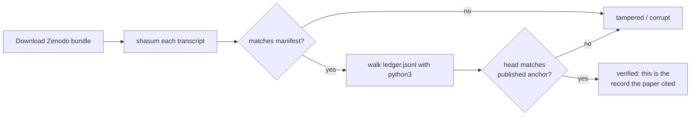

# Verify it yourself

Every claim holotype makes about an archive, you can check yourself, **without trusting holotype** and without even having it installed. The archive is a plain git repository, and the verification path uses only stock Unix tools.

That constraint is load-bearing: the reviewer-facing path must never depend on holotype. `verify.py` (which *is* part of holotype) is a convenience. The recipes below are the ground truth.

## What ships with every archive

A `VERIFY.md` lives inside the archive (and inside every `paper_bundle.py` deposit) with the full standalone procedure. It covers two layers.

## Layer 1: per-file integrity (`shasum` + `jq`)

Each session has a `manifest.json` recording the SHA-256 of its transcript. To check one session:

```bash
# Track A: verify the canonical (uncompressed) hash.
# If the transcript is compressed, decompress first (needs zstd):
zstd -dc transcript.jsonl.zst | shasum -a 256
#   -> compare to .sha256 in manifest.json:
jq -r .sha256 manifest.json

# Track B: verify the stored bytes WITHOUT zstd (compressed deposits only):
shasum -a 256 transcript.jsonl.zst
jq -r .sha256_compressed manifest.json
```

**Either track is sufficient; both must succeed for a valid deposit.** Track B exists precisely so a reviewer with no `zstd` can still verify.

## Layer 2: the hash chain (`python3`, stdlib only)

Per-file hashing proves each file matches its own manifest, but a co-edited transcript+manifest pair would pass it. The ledger closes that gap. Walking it requires no holotype import, only stock `python3`:

1. Read `.holotype/ledger.jsonl` line by line.
2. For each link, recompute `chain_hash = SHA-256(content_identity ‖ prev_chain_hash)`.
3. Confirm each recomputed hash matches the stored one, and that the final link equals the **published head** cited in the paper.

A mismatch anywhere means **insertion or deletion**. A deposit with no corresponding link (or a link with no deposit) is an **orphan**. The `VERIFY.md` in each bundle ships the exact stdlib walk script, with no dependencies to install.

## The reviewer's full path

A reviewer five years out, holding a published DOI and a paper that cites session `3f1c4cf7`:



No holotype. No network (the bundle is self-contained). No trust in us: only `shasum`, `jq`, and `python3`.

## If you do have holotype installed

`verify.py` automates both layers in one command:

```bash
python scripts/verify.py        # per-file + full hash-chain walk
```

It may import `holotype.*`; it's part of the tool. Use it for convenience; fall back to the recipes above when you want a holotype-free check, which is the whole point.

---

This is what we mean by *not a black box*: the strongest claim holotype makes (*"this is the exact record"*) is the one you can independently confirm with tools that predate holotype by decades.

[:octicons-arrow-right-24: Cite it / install it](cite.md)
